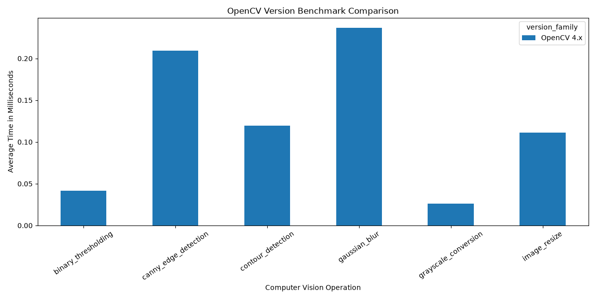
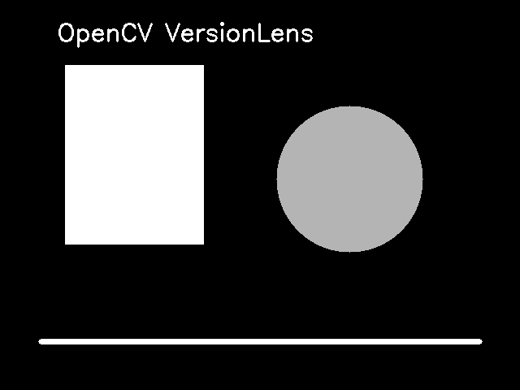
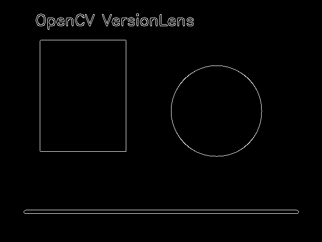

# OpenCV VersionLens

OpenCV VersionLens is a computer vision benchmarking project that compares older and newer OpenCV versions across common image processing workloads.

The goal of this project is to understand how OpenCV version changes affect performance, usability, migration planning, and practical computer vision workflows.

## Project Objective

This project compares OpenCV 4.x and OpenCV 5.x using the same benchmark tasks to evaluate:

* Version-level differences
* Image processing performance
* Benchmark execution time
* Migration readiness
* Practical impact for computer vision developers

Currently, the project includes OpenCV 4.x benchmark results. The same benchmarking pipeline is designed to support OpenCV 5.x results once OpenCV 5 is available in the Python environment being tested.

## Features

* OpenCV version detection
* Synthetic image generation for repeatable testing
* Benchmarking for common image processing tasks
* CSV-based result storage
* Version comparison script
* Performance chart generation
* Streamlit dashboard for visualization
* Preview outputs for grayscale, blur, and edge detection

## Benchmark Operations

The project currently benchmarks:

* Grayscale conversion
* Gaussian blur
* Canny edge detection
* Image resizing
* Binary thresholding
* Contour detection

## Tech Stack

* Python
* OpenCV
* NumPy
* Pandas
* Matplotlib
* Streamlit
* Git/GitHub

## Project Structure

```text
OpenCV-VersionLens/
│
├── blog/
│   └── .gitkeep
│
├── data/
│   └── sample_image.png
│
├── results/
│   ├── opencv4_benchmark_results.csv
│   ├── combined_benchmark_results.csv
│   ├── benchmark_comparison_chart.png
│   ├── version_status.csv
│   ├── preview_grayscale.png
│   ├── preview_edges.png
│   └── preview_blur.png
│
├── scripts/
│   ├── run_benchmark.py
│   └── compare_versions.py
│
├── requirements-opencv4.txt
├── .gitignore
└── README.md
```

## How It Works

1. `run_benchmark.py` checks the installed OpenCV version.
2. It creates a sample image using OpenCV drawing functions.
3. It runs multiple image processing operations.
4. Each operation is executed multiple times.
5. Average execution time is saved to a CSV file.
6. `compare_versions.py` combines benchmark files and creates a chart.
7. `app.py` displays results in a Streamlit dashboard.

## Setup Instructions

Clone the repository:

```bash
git clone https://github.com/codewithshreyak-prog/OpenCV-VersionLens.git
cd OpenCV-VersionLens
```

Create and activate a virtual environment:

```bash
python3 -m venv venv
source venv/bin/activate
```

Install dependencies:

```bash
pip install --upgrade pip
pip install -r requirements-opencv4.txt
```

Run the benchmark:

```bash
python scripts/run_benchmark.py
```

Generate comparison results:

```bash
python scripts/compare_versions.py
```

Run the dashboard:

```bash
streamlit run scripts/app.py
```

## Dashboard Preview

The Streamlit dashboard displays benchmark metrics, comparison charts, CSV results, and image output previews.



## Sample Image Processing Outputs

### Grayscale Output



### Canny Edge Output



### Gaussian Blur Output


## Current Result Summary

The current benchmark was executed using OpenCV 4.x.

The project is designed so that when OpenCV 5.x is available in the Python environment, the same benchmark script can be run again and the comparison script will automatically combine OpenCV 4.x and OpenCV 5.x results.

## Why This Project Matters

Computer vision libraries evolve quickly. A new major version can introduce performance changes, API updates, migration issues, and new capabilities.

This project shows how to evaluate a version upgrade practically instead of only reading release notes. It demonstrates benchmarking, result tracking, visualization, and documentation for a real computer vision workflow.

## Future Improvements

* Add OpenCV 5.x benchmark results
* Add video frame processing FPS benchmark
* Add ONNX/DNN inference benchmark
* Add real-world image dataset testing
* Add automated benchmark reports
* Deploy dashboard using Streamlit Cloud

## Author

Built by Karamchedu Shreya as a computer vision portfolio project.
